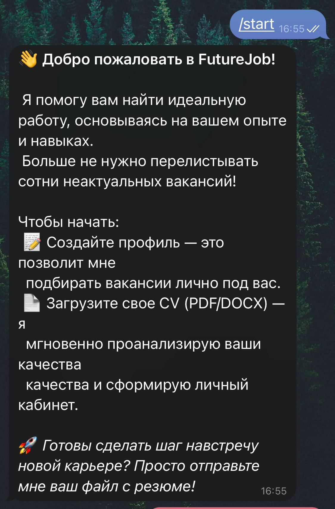
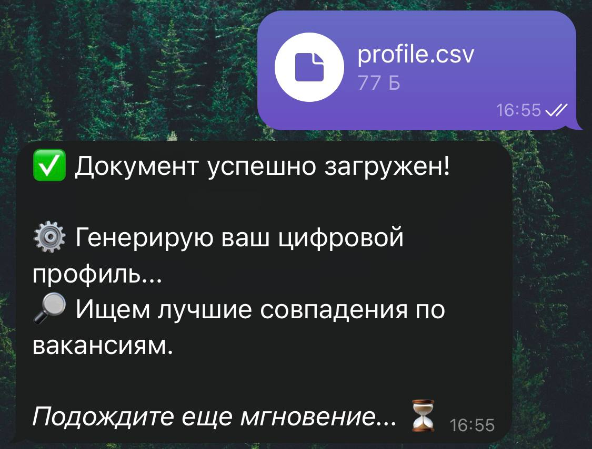
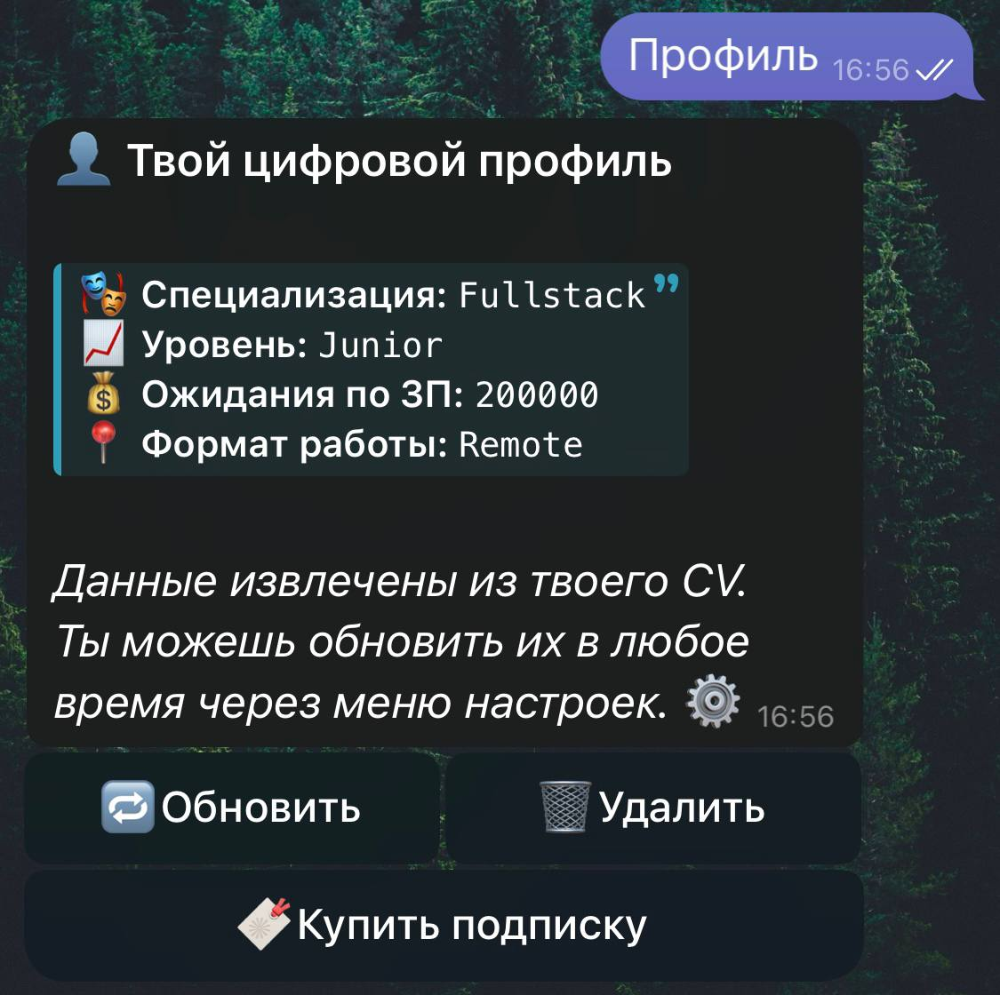
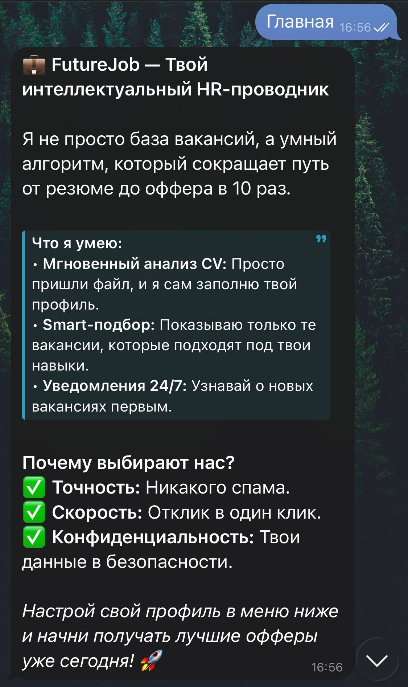
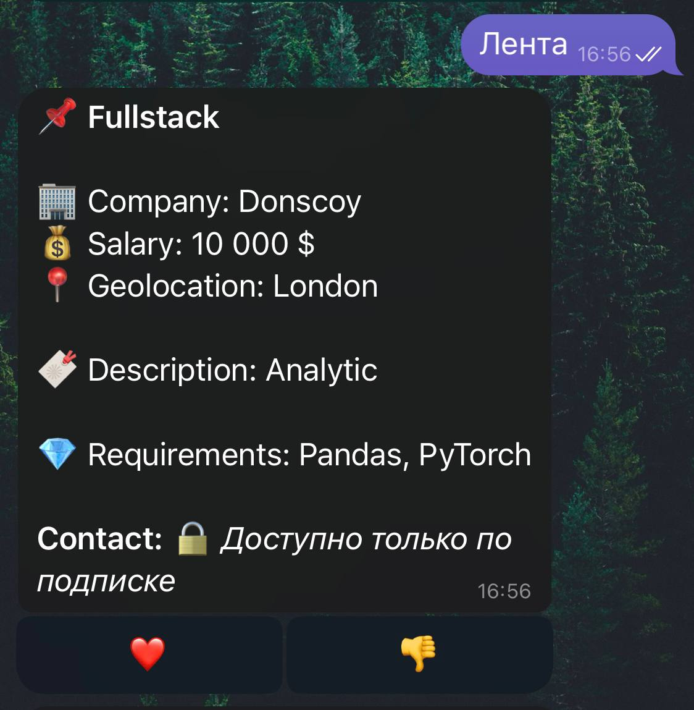
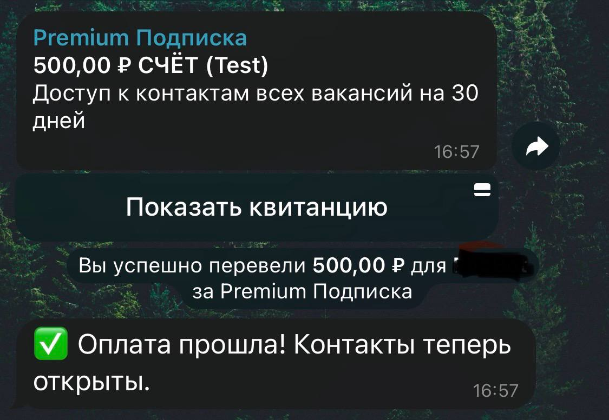
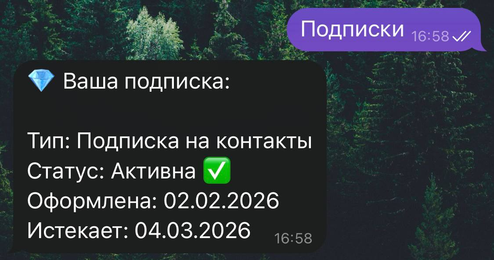
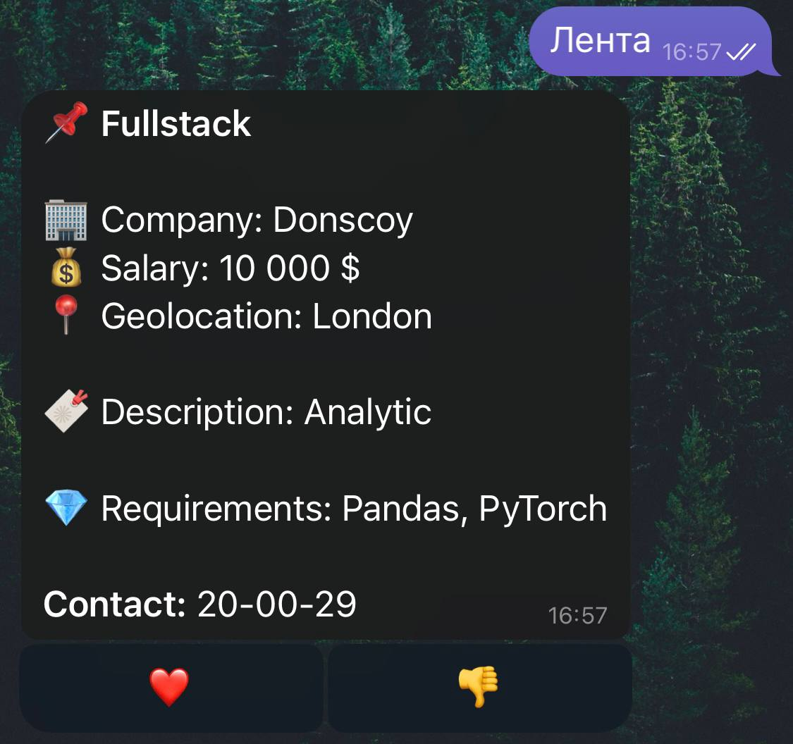

🤖 Future Job: Твой интеллектуальный HR-проводник

Интеллектуальный Telegram-бот для автоматизации поиска работы и подбора вакансий.

## 📸 Скриншоты

  

 

  

  

  

  

  

  

---

## 🌟 Основные возможности

> **Умный подход к карьере:**
> - 📄 **Мгновенный анализ CV:** Просто пришли файл.
> - 🎯 **Smart-подбор:** Показываю только те вакансии, которые подходят под твои навыки.
> - 🔔 **Уведомления 24/7:** Узнавай о новых вакансиях первым.

---

## 🛠 Технологический стек

Проект построен на современном стеке технологий для обеспечения высокой скорости и масштабируемости:

*   **Язык:** [Python 3.10+](https://www.python.org)
*   **Фреймворк бота:** [aiogram 3.x](https://docs.aiogram.dev) (Асинхронная работа с Telegram API)
*   **База данных:** [PostgreSQL](https://www.postgresql.org)
*   **ORM:** [SQLAlchemy 2.0](https://www.sqlalchemy.org)
*   **Миграции:** [Alembic](https://alembic.sqlalchemy.org)
*   **Платежная интеграция:** [PayMaster](https://info.paymaster.ru/api/)
*   **Логирование:** [Loguru](https://github.com)

---

## 🚀 Инструкция:

    1. Клонируйте проект.
    2. Установите зависимости: pip install -r requirements.txt
    3. Заполните файл .env
    4. Запустите проект: python run_app.py

---

**⚠️ FutureJob: Данный проект разработан как рабочий прототип идеи.
    Что реализованно в данном проекте:
*    **1. Клавиатура(кнопки).**
*    **2. Подключена База Данных.**
*    **3. Подключена платежная система.**
*  **Остальной функционал, такой как: Парсинг вакансий, Доп.сервисы, Миграции не реализованны.
     В дальнейшем проект будет дорабатываться!**

---
